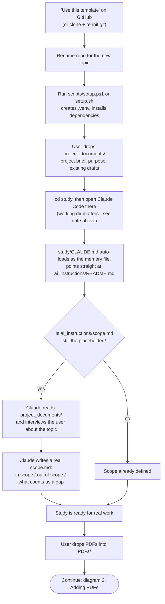
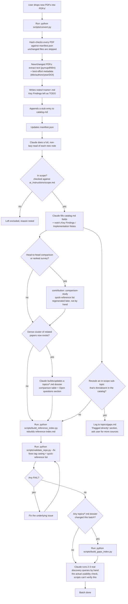
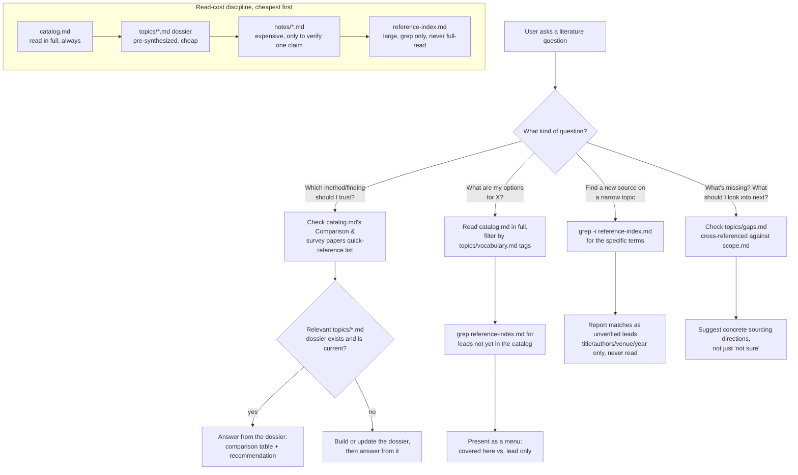
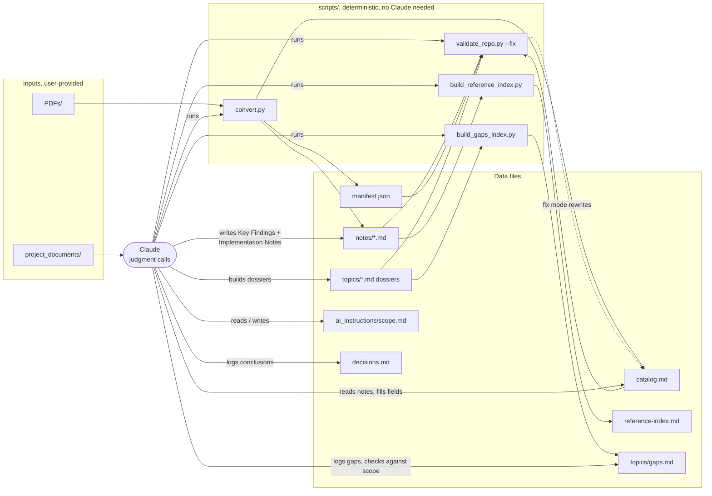
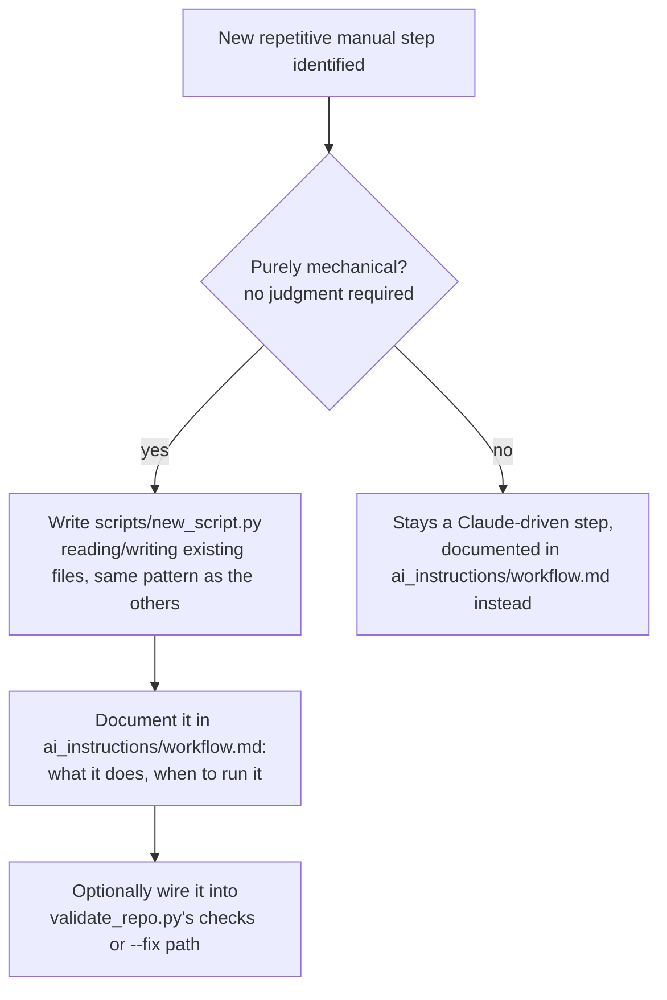

# Workflow diagrams

Five diagrams covering this repo's process end to end: starting a new
study, the PDF batch pipeline, how Claude answers a literature question,
which script reads/writes which file, and how the pipeline itself grows.
These render natively on GitHub and in most markdown viewers (no
extension needed). Read alongside `ai_instructions/workflow.md`, which
these diagrams summarize graphically — that file is the authoritative
text version if the two ever disagree. Not depicted here, to keep these
diagrams readable: `ai_instructions/batch-orchestration.md`,
`long-running-sessions.md`, and `project_documents/source-access.md` —
situational extensions to diagram 2's pipeline, read directly rather than
via a diagram.

## 1. Starting a new study

From "just cloned the template" to "ready to process real PDFs." Note on
step E: `study/CLAUDE.md` only loads automatically as Claude Code's
memory file when `study/` is the actual working directory it was started
in — starting from the repo root instead isn't guaranteed to pick it up
until Claude happens to explore into `study/` on its own, so `cd study`
first is the reliable path.

## 2. Adding PDFs (the batch pipeline)

The core loop, run once per batch of new PDFs — mirrors
`ai_instructions/workflow.md`'s "Processing new PDFs" section exactly.

## 3. Answering a literature question

How Claude routes a question and how much it reads to answer it — cost
discipline matters here since `notes/` and `reference-index.md` get
expensive at scale.

## 4. System map: which script touches which file

Deterministic scripts move data mechanically; Claude is the only actor
that makes judgment calls, and it's also what triggers the scripts.

## 5. Extending the pipeline (adding a new script)

What happens when a new repetitive manual step shows up and someone
decides it's worth automating.

