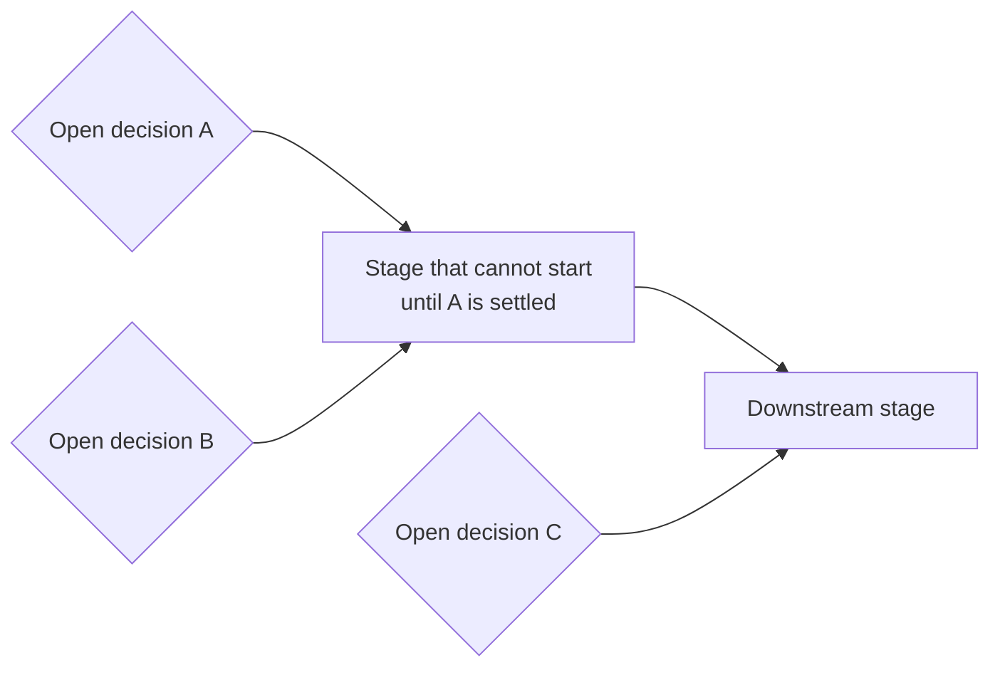

# Timeline

Milestones, deadlines, and blockers for this project. Deliberately *not*
a description of the project's structure — see `ideation/README.md` for
that distinction, which is worth keeping sharp: **what the pieces are**
and **what order we do them in** are constantly confused for each other,
and merging them produces a document that answers neither question.

This file is about ordering and dependency only: what has to happen
before what, what is currently blocked, and on whom.

## Dependency graph

The question this diagram answers: *which open decisions are currently
blocking which stages of work?* Keep it small — nodes are a few words,
and anything needing a sentence belongs in the prose below it. (Replace
the placeholder below with the real graph; the shape is what matters.)

## Milestones

| Date | Milestone | Depends on | Status |
| --- | --- | --- | --- |
| | | | |

## Blockers

Things currently stopping work, with who or what would unblock them.
A blocker that is really an unanswered research question belongs in
`study/topics/gaps.md` instead, so it gets picked up by gap-flagging.

<!-- - **<what's blocked>** — blocked on <what/whom>, since <date>. -->

## Citations

Files at this level follow the repo-wide citation convention — numbered
`[1]`, `[2]` markers plus a `## References` section at the bottom, per
file. See the root `CLAUDE.md`.
